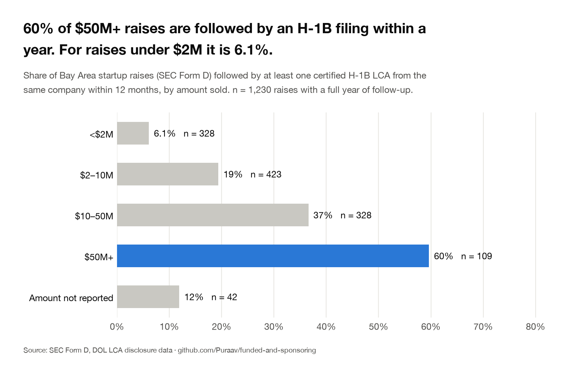
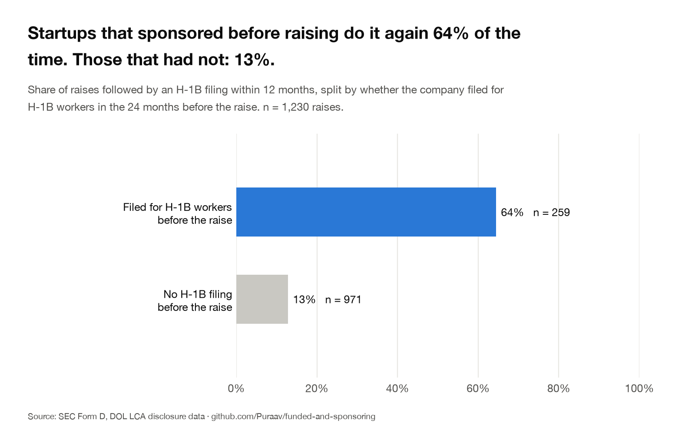
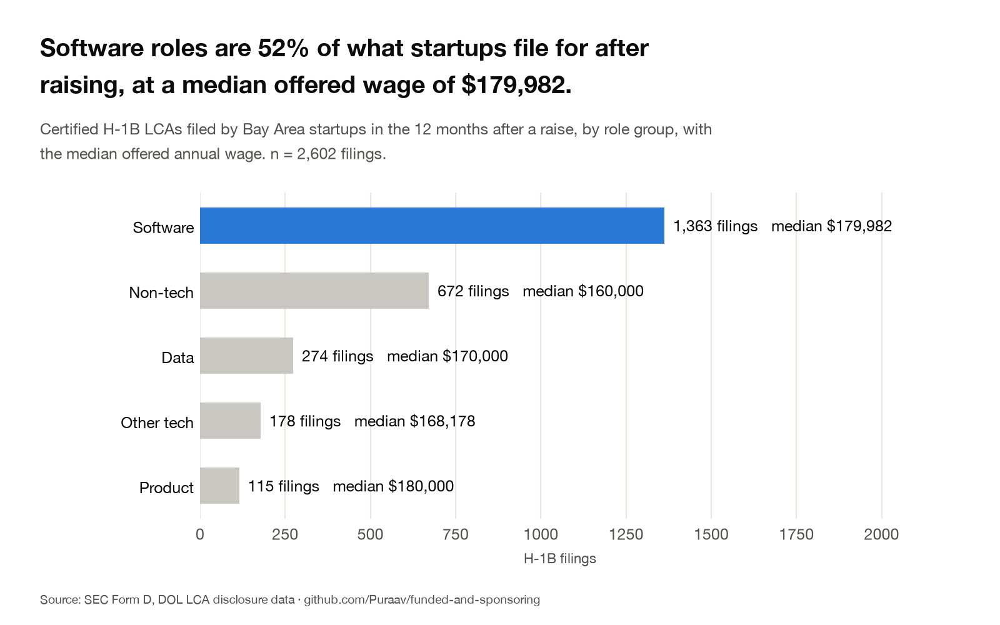
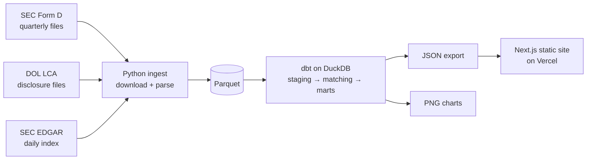
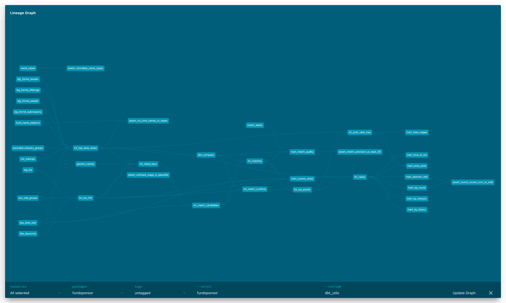

# Funded & Sponsoring

**Of the Bay Area startups that raise money, how many file for H-1B workers within a year, for which roles, and at what pay? And which startups raised recently and have sponsored before?**

[](https://github.com/Puraav/funded-and-sponsoring/actions/workflows/ci.yml)

**Live site:** not deployed yet (the link goes here once it is on Vercel)

Two free public datasets, SEC Form D filings and Department of Labor LCA disclosure data, joined on company name and address. Python downloads the files, dbt on DuckDB does every transformation, and a static Next.js site shows the result.

## Headline findings

<!-- FINDINGS:START -->
1. 24% of Bay Area startup raises were followed by at least one H-1B filing from the same company within a year (n = 1,230 raises). Counting only filings for new hires, not extensions, it is 21%.
2. Bigger raises file far more often: 60% of raises of $50M or more were followed by an H-1B filing (n = 109), against 6.1% of raises under $2M (n = 328). $2–10M: 19% (n = 423). $10–50M: 37% (n = 328).
3. Past behaviour is the strongest signal: startups that had filed for H-1B workers in the two years before raising filed again within a year 64% of the time (n = 259); those with no earlier filing did so 13% of the time (n = 971).
4. Software roles are 52% of the H-1B filings startups make in the year after raising, at a median offered wage of $179,982 (n = 1,363 of 2,602 filings).
5. 45% of the startups that filed after raising filed for at least one early-career tech role: a software, data or product job at prevailing wage Level I or II (n = 240 startups).
6. When a raise is followed by an H-1B filing, the first one comes a median of 98 days after the Form D, and a quarter come within 35 days (n = 292 raises).
7. These startups are a small slice of Bay Area sponsorship: 4.6% of the region's H-1B employers and 2.1% of its filings (n = 10,945 employers, 292,785 filings).

_Match quality: 504 of 1,614 startups (31%) were matched to an H-1B employer. In a checked sample, 60 of 60 matches were correct. An unmatched startup counts as not filing, so the rates above are a floor._

_Based on 2,064 raises by 1,614 startups filed from 2023-10-02 to 2026-09-30. Rates use raises up to 2025-06-23, the last with a full year of LCA data after them (the data runs to 2026-06-23). An LCA is an application step before an H-1B petition, not an approved visa or a hire._
<!-- FINDINGS:END -->







More charts are in [`charts/`](charts).

## Why this is new

Two kinds of tools already exist, and they do not talk to each other:

- **Funding trackers** list who raised money. They are built for sales teams and say nothing about visas.
- **Visa sponsor databases** list who filed for H-1B workers. They look backward and are dominated by large companies.

This project joins the two, so it can ask whether raising money is followed by sponsoring, and can spot a startup that has sponsored before in the week it raises again.

## How it is built



- **Python** (`ingest/`) only downloads, parses raw files to Parquet, exports JSON and draws charts.
- **SQL and dbt** (`dbt/`) do all the cleaning, the entity matching, the metrics and the tests.
- **Next.js + TypeScript** (`web/`) is a fully static site with one page per startup.

<!-- STATS:START -->
The dbt project has 34 models, 9 seeds and 154 dbt tests.

| Matching rule | Confidence | Matched pairs | Checked | Correct |
|---|---|---|---|---|
| Same name, same ZIP | high | 515 | 24 | 24 |
| Same name, Bay Area | high | 199 | 23 | 23 |
| Same name, California | medium | 12 | 12 | 12 |
| Similar name, same 3-digit ZIP | medium | 1 | 1 | 1 |
<!-- STATS:END -->



## The radar

The quarterly Form D files lag by up to three months, so a second, lighter pipeline reads new filings straight from SEC EDGAR every Monday and ranks the Bay Area startups that just raised by their H-1B filing history. The score runs from 0 to 100:

| Points | For |
|---|---|
| up to 40 | certified H-1B LCAs in the 24 months before the raise (log scale, full marks at 50 filings) |
| 25 | any of them for a software, data or product role |
| 15 | any of them at prevailing wage Level I or II (early-career) |
| up to 20 | the amount raised (under $2M: 5, $2–10M: 10, $10–50M: 15, $50M or more: 20) |

A high score means the company sponsored recently and just raised money. It does not mean it has open roles or will sponsor again. Each week's list is saved in [`radar/`](radar) and shown on the site's Radar page. Nothing is sent to companies automatically.

## Data sources

- [SEC Form D data sets](https://www.sec.gov/data-research/sec-markets-data/form-d-data-sets): who raised, when, how much, where.
- [DOL LCA disclosure data](https://www.dol.gov/agencies/eta/foreign-labor/performance): which employers filed H-1B wage applications, for which job, at what wage.
- [SEC EDGAR daily index](https://www.sec.gov/Archives/edgar/daily-index/): new Form D filings for the radar.
- [Census 2020 ZCTA to county relationship file](https://www.census.gov/geographies/reference-files/time-series/geo/relationship-files.2020.html): which ZIP codes are in the Bay Area.

## Definitions

- **Bay Area:** Alameda, Contra Costa, Marin, Napa, San Francisco, San Mateo, Santa Clara, Solano and Sonoma counties. A ZIP code belongs to the county holding most of its land.
- **Startup raise:** an original Form D (not an amendment) from a Bay Area operating company. Funds, SPVs, real-estate vehicles, mergers, companies already registered with the SEC (listed companies) and two long-established firms ([`not_startups.csv`](dbt/seeds/not_startups.csv)) are left out.
- **Sponsoring event:** a certified H-1B LCA whose employer matches the startup.
- **New-hire LCA:** an LCA for a worker new to the employer, not an extension.
- **Followed by a filing:** at least one sponsoring event on the day of the Form D or in the 12 months after. Only raises with a full year of LCA data after them count in the rates.

## Match quality

Company names are normalised (case, punctuation, legal suffixes) and matched by four rules, strictest first. A sample of matches was then checked against the street addresses on both filings and against public sources. The check was done with AI assistance; every row, its evidence and its confidence is in [`data/match_review.md`](data/match_review.md). The per-rule counts are in the table under "How it is built". The samples per rule are small, so read the result as "no errors found", not as a guarantee.

## Limitations

- An LCA is an application step, not an approved H-1B or an actual hire.
- Form D is filed by many but not all startups; some file late or not at all.
- Matching relies on legal names. A startup that files LCAs under a different name, or from outside California, is missed and counted as not filing, so the rates are a floor.
- Form D amounts are self-reported.
- LCA data starts in October 2022, so "the 24 months before" is only 12 to 24 months long for raises made in late 2023.
- These are associations. A raise followed by a filing does not show that the money caused the filing.

## Run it yourself

Needs Python 3.11+, Node 20+ and about 2 GB of disk for the raw downloads.

```bash
python -m venv .venv && source .venv/bin/activate
pip install -e ".[dev]"
cp .env.example .env            # then set SEC_USER_AGENT="Your Name your@email"

python -m fundsponsor.fetch_formd          # SEC Form D, about 100 MB
python -m fundsponsor.fetch_lca            # DOL LCA, about 1.6 GB
python -m fundsponsor.make_seeds

cd dbt && dbt deps && dbt seed && dbt build && cd ..

python -m fundsponsor.findings             # data/findings.json + the block above
python -m fundsponsor.charts               # charts/*.png
python -m fundsponsor.export_site          # web/public/data/*.json

# the radar
python -m fundsponsor.export_seed_cache
python -m fundsponsor.fetch_edgar_recent --days 30
cd dbt && dbt build --select +radar --indirect-selection=cautious && cd ..
python -m fundsponsor.export_radar

cd web && npm install && npm run dev       # http://localhost:3000
```

Checks: `ruff check .`, `pytest -q`, and in `web/`: `npm run lint`, `npm run build`, `npx playwright test`. The tests run on small synthetic files in `tests/fixtures/`; every company in them is invented.

## Project structure

```
ingest/fundsponsor/   Python: download, parse, export, charts
dbt/                  dbt project: staging, intermediate, marts, radar, seeds, tests
web/                  Next.js site (static export)
tests/                pytest and synthetic fixtures
specs/                the build specs, each with notes on what the real data looked like
charts/               PNG charts
radar/                the weekly radar lists
data/                 findings.json, the checked match sample, the radar's small extracts
```

## Why I built this

<!-- PURAAV: 2–3 sentences in your words -->

## License

MIT. See [LICENSE](LICENSE).
